# Where the errors in the published neural winding output come from (PHercParis4)

Scrypt, technical note, Oct 5, 2026 (population-stats addendum included).

## Lead findings

1. **The team's published neural winding output counts sheet crossings correctly along a single ray, but its absolute winding numbers are locally wrong.** Comparing it with human relative-winding chains on PHercParis4: **93 of 94** ray-pairs agree with the human winding difference. The disagreements we could confirm all come from the **starting (seed) winding number assigned to each ray**. Two rays crossing the same sheet can differ by ±1 or ±2. In one case a ray's level order runs opposite to the sheet order.

2. **Our automatic relative-winding chains did not improve a spiral fit.** On a reduced local fit of 400 slices (z 10900–11300), held-out human adjacent-pair accuracy was **84.1%** with no relative-winding constraints and **78.9%** when the fit was given only our auto chains (means over 3 seeds). Auto chains hurt on every seed and every metric we measured. We are **not** pitching them as an improvement.

**Circularity caveat (applies to finding 1).** The per-ray starting numbers come from a spiral fit that already used these same human relative-winding labels. So finding 1 is not an independent test of the neural model. What it shows is that the fitted seeds are locally inconsistent with the labels the fit was given, while the crossing detector itself agrees with the humans.

**Circularity caveat (applies to finding 2).** Both fit arms used the team's published neural winding output as supervision. That output itself came from a fit that used human labels. So finding 2 is a comparison of "neural winding + shell + same-winding PCLs" against the same plus our auto chains, not a test of the neural winding in isolation.

---

## Part A. Diagnosis of the published neural winding output

### Data
- **Neural output:** `spiral_datasets/PHercParis4/winding_inference/` (1.15M rays, 22.7M crossings). Absolute winding of a crossing = `seed_winding[ray] + crossing_level`. Coordinates are the fit space (masked 2.4 µm scan, level 2, 9.6 µm voxels).
- **Human labels:** `relative_windings.json` (300 chains, 2,173 points). In a chain, the difference in `wind_a` between two points equals their winding difference; consecutive points step +1.
- **Visual reference:** the m7 surface prediction at level 0 (same grid).

### Methods
1. **Per-ray relative counts.** If one ray passes within 4 voxels of two points of the same human chain, the neural winding difference is read off that ray alone (interpolated level at each point's projection; no seed involved). Compare with the human difference. (`checker/single_ray.py`)
2. **Seed consistency anchored on human chains.** For every chain point and every ray within DR voxels (primary DR=6; widened to DR=8), compute u = neural w − `wind_a`. If the neural output agreed with the chain, u would be one constant per chain. A ray whose rounded u differs from the chain's consensus (≥3 rays at ≥2 points) is a candidate seed error. Candidates are kept only where another ray at the same human point agrees with the consensus. (`checker/chain_offsets.py`)
3. **Verification of each candidate:**
   - Figure: 5-slice max projection of m7; yellow = human points labelled with consensus winding; red = offending ray; cyan = other rays.
   - Geometric test: in a 17×96×96 m7 box, label 26-connected sheet components. On components that contain exactly one human label, compare every red and cyan crossing's winding with the human label.
   - **Confirmed:** red differs from the human label by ≥1 on the same sheet, and all other rays agree with it.
   - **Probable:** red differs, but another ray also disagrees.
   - **Ambiguous:** neighbourhood inconsistent or sheets merged.

### Numbers
- **Per-ray counts:** 94 ray-pairs; 93 agree; 1 disagrees (ray 134617 = case 02 below).
- **Chain anchoring (DR=6):** 48 chains had enough rays; 238 rays scored; 30 off consensus by ≥0.75 winding; 10 of those also have another ray at the same point that agrees with the consensus → **5 confirmed, 2 probable, 3 ambiguous**.
- **Widened search (DR=8) on the same already-downloaded `winding_inference` + human chains:** 37 strong candidates; 21 new after excluding the DR=6 ten. Same 3D same-sheet confirmation standard (tiny m7 crops only; no large downloads). Of the 21: **10 confirmed, 6 probable, 5 ambiguous**.
- **Totals (honest union):** **15 confirmed**, 8 probable, 8 ambiguous. Probable/ambiguous stay separate from confirmed.

#### Confirmed (DR=6 primary set)

| Case | Chain | Ray | z | Red − human (windings) | Other rays − human | Verdict |
|---|---|---|---|---|---|---|
| 01 | col172 | 186900 | 8879 | −1, −1 | 0, 0, 0 | confirmed |
| 02 | wraps2 | 134617 | 16920 | +4 … +18 (level order runs opposite to sheet order) | 0 (×12) | confirmed |
| 03 | col22 | 391270 | 15080 | −1, −1, −1 | 0 (×4) | confirmed (crossings 4–6 slices off-plane) |
| 07 | col58 | 187628 | 9185 | −1 | 0, 0, 0 | confirmed |
| 08 | col63 | 272472 | 9407 | +1, +1 | 0, 0, 0 | confirmed |

#### Confirmed (DR=8 expansion, Oct 5)

| Case | Chain | Ray | z | Red − human (windings) | Other rays − human | Verdict |
|---|---|---|---|---|---|---|
| 10 | col147 | 7036 | 8980 | -1 (×6) | 0 (×6) | confirmed (DR=8) |
| 11 | col22 | 356196 | 15092 | -1, -1, -1 | 0 | confirmed (DR=8) |
| 12 | col289 | 8031 | 10195 | -1 | 0, 0 | confirmed (DR=8) |
| 13 | col68 | 474925 | 7674 | 1 | 0, 0, 0 | confirmed (DR=8) |
| 14 | col70 | 214071 | 9185 | -1, -1 | 0, 0, 0, 0 | confirmed (DR=8) |
| 18 | col126 | 144441 | 11228 | -1, -1, -1, -1 | 0 (×5) | confirmed (DR=8) |
| 22 | col67 | 482054 | 9357 | 1 | 0, 0 | confirmed (DR=8) |
| 23 | col67 | 737710 | 9376 | 1 | 0 | confirmed (DR=8) |
| 27 | col43 | 68143 | 11714 | -1 | 0, 0 | confirmed (DR=8) |
| 29 | col89 | 440658 | 8750 | -1, -1 | 0, 0 | confirmed (DR=8) |

#### Probable / ambiguous (kept separate)
- **DR=6 probable:** case 00 (col115), case 06 (col270). **DR=6 ambiguous:** cases 04, 05, 09.
- **DR=8 probable (6):** 16/col17, 17/col63, 20/col160, 24/col166, 25/col221, 26/col118.
- **DR=8 ambiguous (5):** 15/col147, 19/col173, 21/col67, 28/col60, 30/col89.

### Can the checker work without human labels?
We tested a label-free rule: each ray is compared with neighbouring rays near shared crossings and flagged if most neighbours disagree. Parameters were fixed by a label-free coverage rule (neighbour radius 6 px, window 100 px; a second setting at 12 px was also run), then scored afterwards against a strict human-anchored reference (171 rays, 29 off; fractional offsets 0.25–0.75 excluded).

| Setting | Coverage | Precision | Recall | Base rate |
|---|---|---|---|---|
| 6 px | 48.5% | 42.9% | 63.2% | 22.9% |
| 12 px | 81% | 47.2% | 65.4% | 18.7% |

Better than chance (about 2–2.5× the base rate), but more than half of its flags are false and about a third of errors are missed. It catches 3 of the original 5 confirmed cases (not re-scored on the DR=8 expansion). **Dropped as a standalone tool**; usable only for triage with human-chain confirmation.

### Limitations (Part A)
- Circularity of the seeds (see lead findings).
- Human chains are taken as correct. In every confirmed case the chain visibly steps one sheet per point, but there was no independent audit.
- Sparse sample: neural crossings lie on m7 sheets only loosely (median distance 2 px; only 28% of crossings lie exactly on the mask). Fifteen confirmed cases from a few hundred scored rays is still not an error-rate estimate for the 1.15M rays.
- Figures are max projections over 5 slices; some red crossings are up to 6 slices off-plane (case 03). The 3D component test addresses this but relies on the m7 prediction's topology.
- Scope: PHercParis4 only.

---

## Part B. Negative result: automatic relative-winding chains in a spiral fit

### What we tried
A CPU method (`scrypt_vc/winding/`) builds relative-winding chains from 2D slices of the m7 surface prediction: skeletonize, cut radially, sync chunk windings with cycle checks, export chains of consecutive +1 steps at confidence ≥0.99.

On 7 held-out slices (labels disjoint from the one tuning slice; threshold 0.98 fixed on the tuning slice only), adjacent human pairs agreed at **95.3%** with 83.3% coverage (424/509). Without skipping: 91.7% at 94.7% coverage. A leave-one-slice-out hybrid of our method for nearby pairs and a straight-line sheet-count baseline for far pairs did **not** beat the baseline overall (77.0% vs 77.2%). Our method only helps below about 50 px.

**Wrong-chain fraction among the export filter (zero-cost, from existing scores).** The fit used chains exported at confidence ≥0.99 (the export rule fixed before the fit, not re-tuned on held-out labels). On held-out adjacent human pairs that our graph also scored at that same filter, agreement was 97.1% (12 of 408 wrong). That characterises the filter, not the fit range itself: the auto chains fed to the fit came from z 10950–11250, and we have no human-pair agreement numbers on those four slices.

### The fit test (Atrium, RTX 2070, Oct 4–5 2026)
**Reduced setup (honest limitations, not a full team fit):**
- No verified patches, normals, tracks or fibers (the fitter's native C++ extension needs a compiler Atrium does not have; Build Tools were not installed). Without patches, relative chains enter only as unattached-strip losses.
- 400 slices (z 10900–11300); 2,000 optimiser steps (default is 30,000).
- Coarser flow grid: `model_flow_voxel_resolution` 20 instead of 16, so checkpoints fit the 3 GB folder budget (269 MB each instead of 511 MB).
- Both arms used the team's neural winding output (subset to this z-range), the outer shell, the umbilicus and human same-winding PCLs. Spiral sense set to CW from our method's σ=+1 and VC3D's chirality rule (catalog metadata was not used).
- Arm 0: no relative-winding constraints. Arm 1: only our auto chains (4,682 chains / 25.8k points from z 10950, 11050, 11150, 11250). **No human relative chains were present on Atrium.**
- Scoring: 28 human relative chains / 137 points / 109 consecutive pairs with every point in range; never given to either fit. Thresholds match the official `satisfaction_metrics` (0.45·dr spiral, 6 voxels scan). Three seeds per arm, seed count fixed before seeing results. The fitter's own final scoring step crashes without the native extension; we scored from the saved checkpoint with our evaluator after that crash.

| Arm | Adjacent pairs (seeds 1/2/3 → mean) | All within-chain pairs (mean) | Points satisfied (mean) | Chains fully satisfied (seeds) |
|---|---|---|---|---|
| 0: no relative constraints | 85.3 / 85.3 / 81.7 → **84.1%** | 55.9% | 44.5% | 4 / 4 / 5 of 28 |
| 1: only our auto chains | 78.9 / 78.0 / 79.8 → **78.9%** | 51.0% | 40.4% | 1 / 3 / 3 of 28 |

**Result: auto chains hurt by −5.2 points on adjacent pairs.** Lower on every seed and every metric.

### Why might they have hurt? (untested hypotheses only)
We did not test these. They are listed so the result is not over-interpreted:
1. Roughly 3% of exported adjacent steps disagree with humans on other held-out slices; wrong chains would conflict with the neural winding supervision.
2. 4,682 chains packed into only 4 slices may over-weight those planes.
3. Without patches, relative chains are only unattached-strip losses, which may interact poorly with the winding-model term.

### Limitations (Part B)
Everything in the reduced-setup list above. Also: the test set is small (28 chains) and clustered at two depths (z ≈ 11044 and 11227). Peak folder size briefly hit 3.066 GB for a few minutes during a smoke run (0.07 GB over the 3 GB budget) before the smoke checkpoint was deleted; subsequent runs peaked at 2.83 GB and finished at 2.567 GB. No out-of-memory. No publish.

---

## Figures (Part A cases)

Red = offending ray; cyan = other rays; yellow = human chain points, labelled `wind_a` + consensus offset. Background is the m7 surface prediction.

### Confirmed
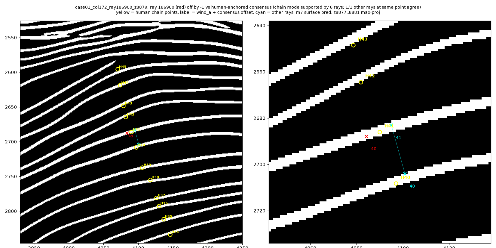
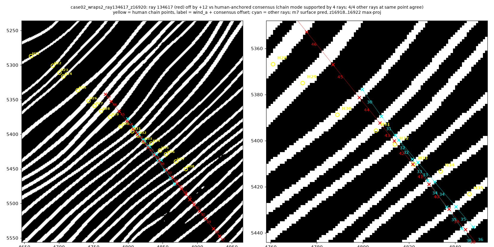
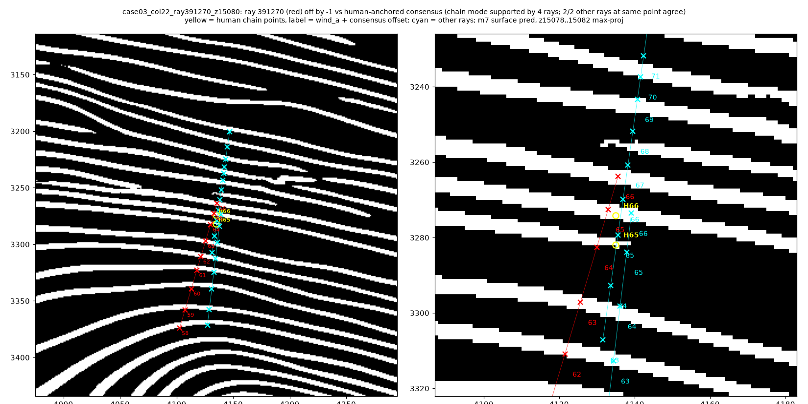
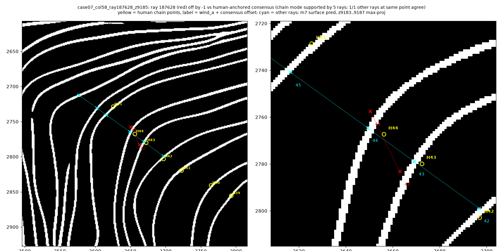
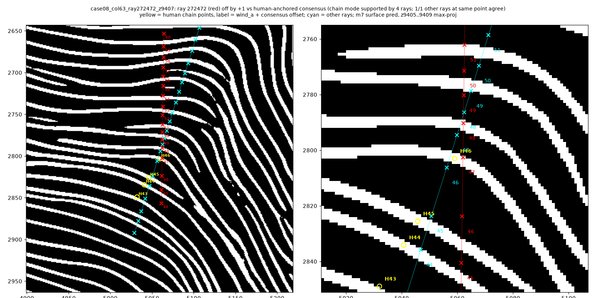

Additional confirmed (DR=8 sample; full set in `checker_cases/`):
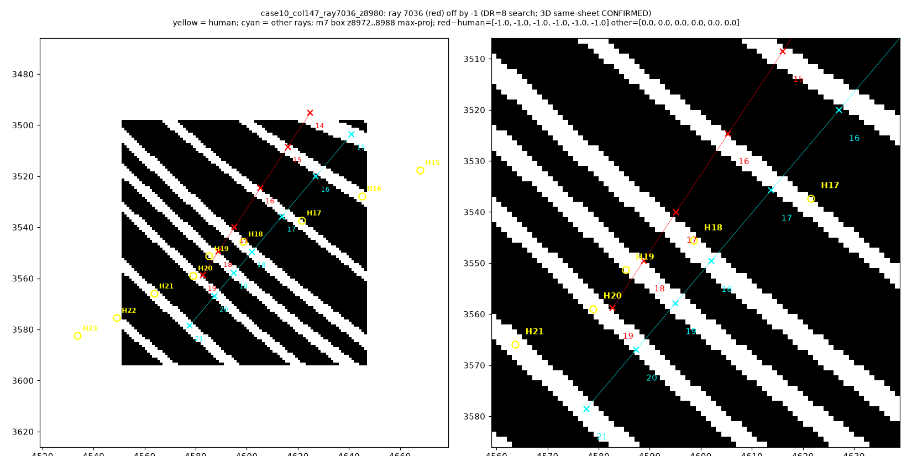
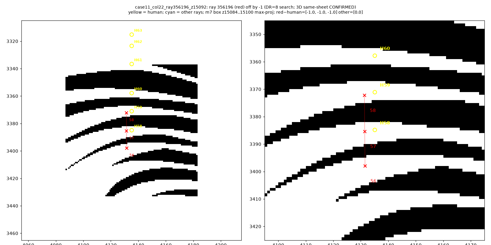
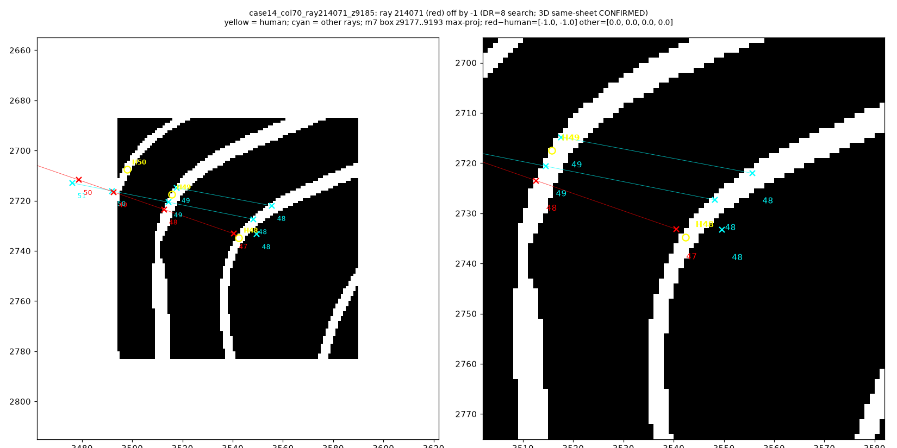
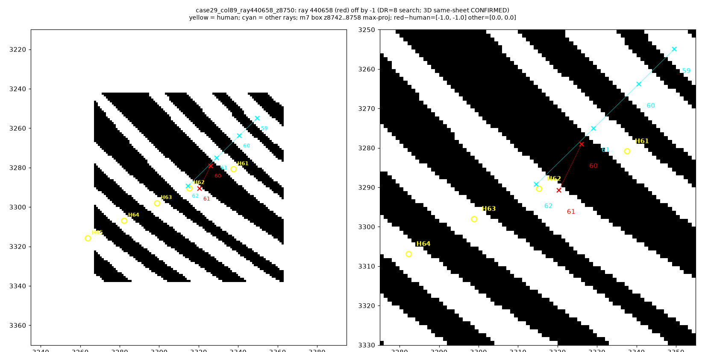

Case 02 animation (level order opposite sheet order): `checker_cases/case02_wrong_direction.gif` (~30 s).

### Probable
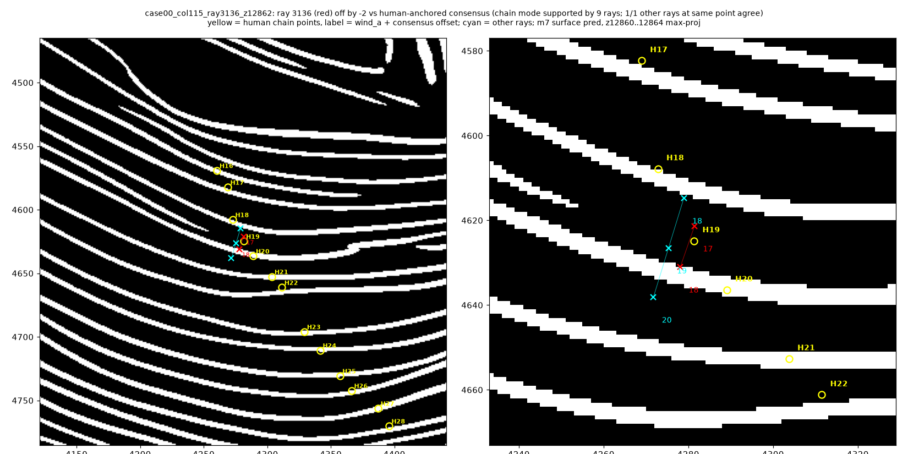
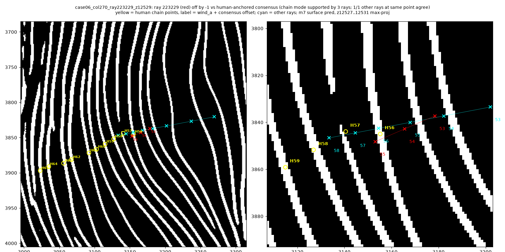

### Ambiguous
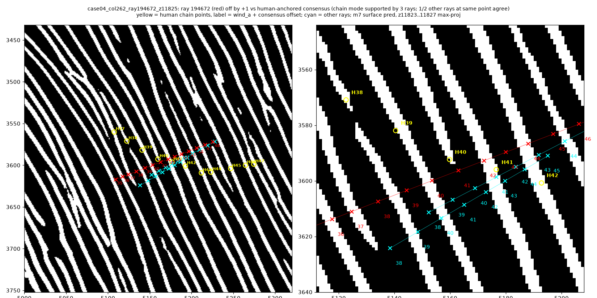
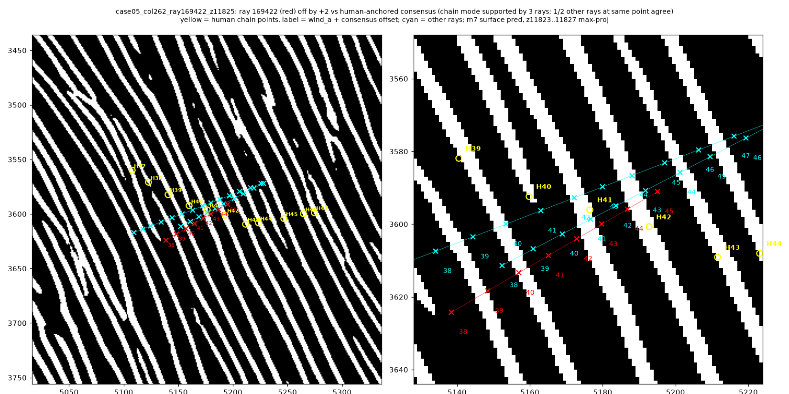
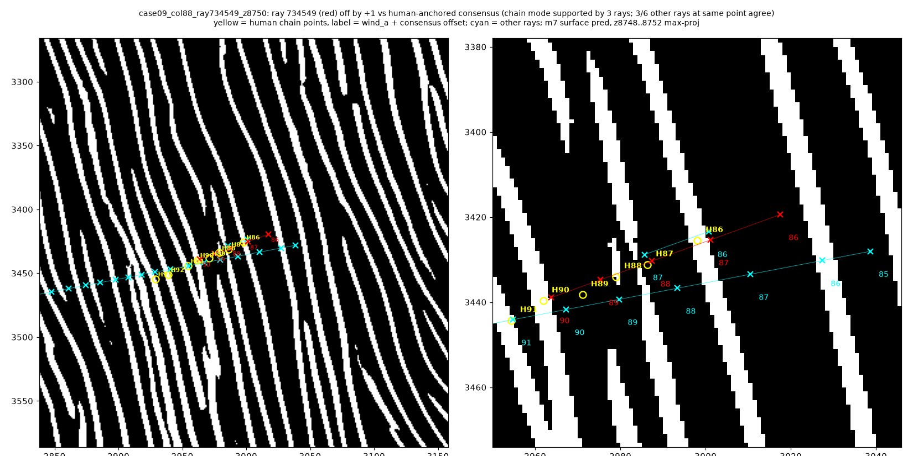

---

## Reproduce
- Diagnosis: `python -m checker` (or `scrypt_vc/run_checker.sh`). Scripts: `ray_field.py`, `single_ray.py`, `chain_offsets.py`, `case_figures.py`, `verify_cc.py`, `labelfree.py`. CPU; ~170 MB of `winding_inference` plus small m7 crops. DR=8 expansion JSON: `out/checker_chain_offsets_dr8.json`; 3D verify of new candidates: `checker_cases/geometric_check_dr8_new.json`.
- Auto chains and rescoring: `scrypt_vc/winding/`.
- Fit + held-out eval: `atrium/` (`run_fit.py`, `eval_heldout.py`, install notes). RTX 2070 8 GB; results in STATUS.md.

Licensing: code under MIT (Scrypt). Figures and derived data come from CC-BY-NC 4.0 scan data and stay within the prize submission; nothing built from that data goes into any Scrypt product.

---

## Addendum (Oct 5 afternoon): population stats and packaging

Zero-cost analysis on the same already-downloaded `winding_inference` + human chains. No new downloads, no GPU.

### Seed vs crossing (clarified)
- **Per-ray relative counts** (seed-free): **93/94** ray-pairs still agree with humans. The one failure is case 02 (ray 134617), where crossing *level order* runs opposite the sheet.
- **All 1.15M `seed_winding` values are exact integers** (median |frac| = 0). Errors are integer seed offsets (or the one reversed-level case), not fractional drift.
- Median crossings per ray: 19 (p10=11, p90=29).

### Population triage rate (not a confirmed-error rate)
At human relative-chain points with ≥2 neural rays within 6 voxels (**n=104**):
- Rounded windings **agree on 52 (50%)** and **disagree on 52 (50%)**.
- Of disagreements, most have span 1 winding (37); span ≥2 is rarer (15).
- **This is a triage signal only.** Confirmation still requires a chain consensus mode plus the 3D same-sheet geometric test. Many disagreements are ambiguous neighbourhoods (see probable/ambiguous cases).

### Confirmed-case taxonomy (geometric median of red−human)
Across all **15 confirmed** cases (13 distinct human chains; z 7674–16920):

| Error type | Count |
|---|---|
| seed offset −1 | 10 |
| seed offset +1 | 4 |
| level order reversed | 1 (case 02) |
| (chain-only ±2 overshoots) | 0 confirmed at ±2 geometrically; cases 12/13/23 had chain_off ±2 but geo median ±1 |

So almost all confirmed seed errors are **±1**. Chain-offset candidates can overshoot the geometric offset by 1 when few red hits land on uniquely labelled sheets — the geometric test is authoritative.

### Packaging for reuse
- Full case table: `checker_cases/case_catalog.json` and `.csv` (DR=6 + DR=8; verdicts kept separate).
- Population stats: `out/winding_inference_population_stats.json`.
- Draft eval-suite schema + filled report: `scrypt_vc/checker/winding_inference_audit.v1.schema.json`, `out/winding_inference_audit.v1.json`.
- Case 02 animation: `checker_cases/case02_wrong_direction.gif` (~30 s).

